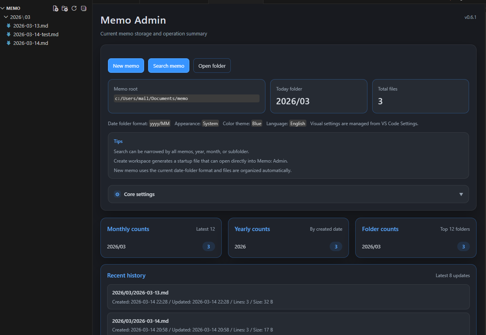

# vscode-memo-life-for-you README

## Memo Admin

日常のメモ操作と直近ファイル確認のための管理画面です。



## インストール

このフォーク版は [GitHub Releases](https://github.com/mmiyaji/vscode-memo-life-for-you/releases) で配布する `.vsix` からインストールします。

1. Releases から最新版の `.vsix` をダウンロードします。
2. VS Code を開きます。
3. コマンドパレットで `Extensions: Install from VSIX...` を実行します。
4. ダウンロードした `.vsix` を選択します。

管理画面中心で使う場合は、インストール後に生成した `.code-workspace` を VS Code で開くと、そのまま運用に入りやすくなります。

## フォークについて

このリポジトリは [satokaz/vscode-memo-life-for-you](https://github.com/satokaz/vscode-memo-life-for-you) をベースにした個人向けフォークです。

## このフォークで追加した主な変更

* `config.toml` の `memoDatePathFormat` による日付ベースの保存階層
* 検索範囲の指定と、テキスト風の grep 結果表示
* 日常運用向けの `Memo: Admin` 管理画面
* `.code-workspace` の生成と、管理画面から始める起動導線
* 管理画面の多言語化、テーマ拡張、履歴表示

これは、Markdown 形式でメモを書くための VS Code 拡張機能です。
作成されたメモは、日付に基づいたファイル名で単一のディレクトリに置かれ管理されます。


* この拡張機能は [memo (Memo Life For You)](https://github.com/mattn/memo) に影響を受け、VS Code と組み合わせて利用できるようにするために作り始めました (現在は、作成されたファイルを memo コマンドでも VS Code でも有効に活用できることを考え、一部の機能を除き、個別に動作するよう実装し直し、ファイルを開くことに特化しています)
* 構成ファイルである `config.toml` と配置先のディレクトリは、memo コマンドと互換性があります
* Memo: New/Edit/Grep/Config コマンドを実行するために、外部に memo コマンドは必要ありません
* もし、Memo: Serve を使う場合は、memo コマンドをインストールする必要があります

## Features


提供されるコマンドは下記のとおりです:

* `Memo: メモの新規作成` - メモを作成 (memo コマンドは必要ありません)
* `Memo: メモのリスト/編集` - 作成されたメモのリストと編集 (memo コマンドは必要ありません)
* `Memo: メモの検索` - 作成されたメモを検索 (memo コマンドは必要ありません)
* `Memo: 設定` - 構成ファイルの編集 (memo コマンドは必要ありません)
* `Memo: サーブ` - memo コマンドに組み込まれた http server を起動し、ブラウザで表示 (memo コマンドが必要です)

ユニークなコマンド:

* `Memo: 今日のメモ` - `YY-MM-DD.md` ファイルに追記 (memo コマンドは必要ありません)
* `Memo: ファイル名の日付を最新に付け替える` - ファイル名に含まれた日付 (YY-MM-DD) を今日の日付に変更する
* `Memo: Todo` - [todo.txt](https://github.com/todotxt/todo.txt) によるタスク管理 (実装中)
* `Memo: メモ格納フォルダを新しい VS Code インスタンスで開く` - メモが格納されているフォルダを新しい VS Code インスタンスでオープンします

### Memo: メモの新規作成

* QuickInput に入力された値をファイル名およびタイトルとして、ファイルを作成
* QuickInput に何も入力せずに Enter を押した場合、日付をベースにした `YY-MM-DD.md` ファイルが作成されます。もし、同じ日付けのファイル名がすでに存在している場合は、上書きせずにそのファイルを開きます
* また、エディタ上で文字列を選択してから、このコマンドを実行すると、選択された文字列がタイトルとファイル名に利用されます
* ファイルは、`Memo: New` コマンドを実行した VS Code インスタンス上で開きます
* ファイルは `preview` 状態で開かれます
* オプション `memo-life-for-you.openMarkdownPreview` を設定することで Markdown Preview を同時に表示することも可能

### Memo: 今日のメモ


* すでにある `YY-MM-DD.md` を開き、追記を行います。もし、ファイルが存在しない場合は、作成してから開きます
* このコマンドを実行すると開かれたファイルの最下行にタイムスタンプを含んだヘッダが追記されます。(例: `## 2017-10-19 Thu 06:38`)
* また、ISO Week とランダムな絵文字をタイムスタンプに追加することができます。(例: `## [Week: 42/52] 😸 42 2017-10-19 Thu 06:26`)
* また、エディタ上で文字列を選択してから、このコマンドを実行すると、タイムスタンプと共に選択された文字列がタイトル名として挿入されます
* ファイルは、`Memo: Today's quick Memo` コマンドを実行した VS Code インスタンス上で開きます

### Memo: メモのリスト/編集


* このコマンドを実行すると、ファイル名とそのファイルの最初の 1 行をリストして表示します。これは、memo コマンドの `memo list` または `memo edit` に似ています
* リストに表示されるファイルの拡張子は `.md`と` .txt`のみです（デフォルト）。これは、`memo-life-for-you.listDisplayExtname` 設定で変更できます。

    ```jsonc
        "memo-life-for-you.listDisplayExtname": [
            "md",
            "txt"
        ],
    ```
    
* QuickInput にキーワードを入力することでリストをフィルタすることが可能です
* キーボードの up/down カーソルキーで移動することが可能です
* `memo-life-for-you.openMarkdownPreview` を設定することにより、選択されたファイルを開くと同時に、Markdown Preview も表示さします。
* 選択されたファイルは、`Memo: Edit` コマンドを実行した VS Code インスタンス上で開きます* また、同時に `Memo Grep` 出力パネルを生成し検索結果を出力します
* ファイルは `preview` 状態で開かれます
* また、同時に `Memo List` 出力パネルを生成し一覧を出力します

#### ファイル選択中の Markdown Preview 表示について


* `"memo-life-for-you.listMarkdownPreview": true` を設定することで、ファイルを Markdown Preview で表示することが可能です。
* この機能を利用するには、[Markdown preview Enhanced](https://marketplace.visualstudio.com/items?itemName=shd101wyy.markdown-preview-enhanced) 拡張機能がインストールされている必要があります
* キーボードでの操作時のみ表示します


### Memo: メモの検索


* VS Code に含まれる `ripgrep` を利用します
* QuickImput にキーワードを入力することで、検索結果を QuickPicker に表示し選択で開くことができます
* 選択されたファイルを開くと、検索結果の該当行と列にカーソルを移動させます
* 選択されたファイルは、`Memo: Grep` コマンドを実行した VS Code インスタンス上で開きます
* ファイルは `preview` 状態で開かれます
* また、同時に `Memo Grep` 出力パネルを生成し検索結果を出力します

#### ripgrep について

QuickPicker 項目は `ripgrep` コマンドの出力から作成されます。 
VS Code に同梱されている `ripgrep` を使用するため、別途インストールする必要はありません。

利用するオプション:

* `--vimgrep` -- Show results with every match on its own line, including line numbers and column numbers.
* `--color never` -- Do not use color in output.
* `-g *.md` -- Include *.md files for searching that match the given glob. 
* `-S` -- Search case insensitively if the pattern is all lowercase.

#### ripgrep 構成ファイル (vscode 1.22 or later (ripgrep 0.8.1) で利用可能)

ripgrep のオプションを指定できるように ripgrpe 構成ファイルをサポートします。

`memo-life-for-you.memoGrepUseRipGrepConfigFile` に `true` を設定すると、構成ファイルとして `$HOME/.ripgreprc` を使用します。

また、任意の場所に配置された構成ファイルを利用したい場合は、`memo-life-for-you.memoGrepUseRipGrepConfigFilePath` に、構成ファイルの絶対パスをセットしてください。(例: `"memo-life-for-you.memoGrepUseRipGrepConfigFilePath": "/Users/satokaz/.vscode-ripgreprc"`)

いずれの場合も、構成ファイルが存在しない場合は、エラーになります。

構成ファイルには、下記のオプションを必ず入れてください: 

```
--vimgrep
```

構成ファイルを使わない時の動作と同じにする設定は、下記となりなす:

```
--vimgrep
--color never
--glob=*.md
--smart-case
```

> 詳しくは、下記を参照してください:
> See: https://github.com/BurntSushi/ripgrep/blob/master/GUIDE.md#configuration-file


### Memo: 設定

* VS Code で構成ファイルを開きます

### Memo: サーブ

* memo コマンドが必要です。この機能が必要ない場合は、memoコマンドをインストールする必要はありません。
* `memo serve` を実行し、memo コマンドの組み込み http サーバを起動し、ブラウザに表示します。プロセスは手動で終了する必要があります。

## About the configuration file

設定ファイルとディレクトリが存在しない場合は、初めに自動的に作成されます。このファイルは、memo コマンドでそのまま使用することもできます。

```yaml
memodir - 作成するメモの配置先ディレクトリを指定 (拡張機能で参照)
editor - 編集に利用するエディタを指定 (拡張機能では参照しない)
column - 表示カラム数 (拡張機能では参照しない)
selectcmd - 使用するセレクタコマンド (拡張機能では参照しない)
grepcmd - 使用する grep コマンド (拡張機能では参照しない)
assetsdir - (拡張機能では参照しない)
pluginsdir - (拡張機能では参照しない)
templatedirfile - (拡張機能では参照しない)
```

デフォルトの構成:

macOS:

```yaml
memodir = "/Users/satokaz/.config/memo/_posts"
editor = "code"
column = 20
selectcmd = "peco"
grepcmd = "/Applications/Visual\\ Studio\\ Code\\ -\\ Insiders.app/Contents/Resources/app/node_modules/vscode-ripgrep/bin/rg -n --no-heading -S ${PATTERN} ${FILES}"
assetsdir = ""
pluginsdir = ""
templatedirfile = ""
```

Windows: 

```yaml
memodir = "C:\\Users\\Sato\\AppData\\Roaming\\memo\\_posts"
editor = "code"
column = 20
selectcmd = "peco"
grepcmd = "grep -nH ${PATTERN} ${FILES}"
assetsdir = ""
pluginsdir = "C:\\Users\\Sato\\AppData\\Roaming\\memo\\plugins"
templatedirfile = ""
templatebodyfile = ""
```

### About the memo command

この拡張機能は、memo コマンドがインストールされていれば全ての機能が利用できますが、memo コマンドは必ずしも必要ではありません。

* `memo` 
   * [memo (Memo Life For You)](https://github.com/mattn/memo)

## Extension Settings

この拡張機能は下記の設定項目を持っています:

* `"memo-life-for-you.memoPath"`: memo コマンドのパス (Serve コマンドを使う場合に必要)
   * ex: Mac/Linux: `"/Users/satokaz/golang/bin/memo"`
   * ex: Windows: `"C:/Users/Sato/go/bin/memo.exe"`
* `"memo-life-for-you.serve-addr"`: server address (Serve コマンドで default: 8080 以外のポートを利用する場合)
   * `memo serve --addr :8083` = ex: "memo-life-for-you.serve-addr": "8083" (default: "8080")
* `"memo-life-for-you.dateFormat"`: date-fns のフォーマット形式 See: https://date-fns.org/v2.16.1/docs/format (default: "yyyy-MM-dd HH:mm")
* `memo-life-for-you.insertISOWeek`: "Memo: Today's quick Memo" コマンド実行時に挿入されるタイトルに ISO Week を追加します
* `memo-life-for-you.insertEmoji`: "Memo: Today's quick Memo" コマンド実行時に挿入されるタイトルに random-Emoji を追加します
* `memo-life-for-you.displayFileBirthTime`: `Memo:リスト/編集` の情報に、ファイル作成日を追加表示します。(default: false)
* `memo-life-for-you.grepLineBackgroundColor`: 検索結果のキーワードの背景色
* `memo-life-for-you.grepKeywordBackgroundColor`: 検索結果のキーワードを含む行の背景色
* `memo-life-for-you.openMarkdownPreview`: エディタでファイル開くと同時に Markdown Preview を開きます (default: false)
* `memo-life-for-you.openNewInstance`: メモを開くときは、新しいインスタンスで開く
* `memo-life-for-you.listSortOrder`: メモのリスト表示を `filename`, `birthtime` または `mtime` で並び替えます 
* `memo-life-for-you.memoGrepUseRipGrepConfigFile`: ripgrep 構成ファイルを利用する (default: $HOME/.ripgreprc)
* `memo-life-for-you.memoGrepUseRipGrepConfigFilePath`: 任意の場所に配置された構成ファイルを利用する場合 (例: /Users/satokaz/.vscode-ripgreprc)
* `memo-life-for-you.memoTodoUserePattern`: Todo として認識するためのパターンを定義します (default: ^.*@todo.*?:)
* `memo-life-for-you.memoNewFilenameFromClipboard`: OS のクリップボードに格納された文字列を新しく作成するファイルの名前として使用する (defaut: false),
* `memo-life-for-you.memoNewFilenameFromSelection`: vscode 上で選択した文字列を新しく作成するファイルの名前として使用する (default: false),
* `memo-life-for-you.memoNewFilNameDateSuffix`: ファイル名（yyyy-MM-dd）の後に日付関連の接尾辞を追加します。追加された文字列は、datefns.format() に渡されます。詳細は、https://date-fns.org/v2.16.1/docs/format を参照してください

   例: 

    * `-dddd` を指定すると、ファイル名は `2018-05-24-Thursday.md` になります
    * `-W` を指定した場合、ファイル名は `2018-05-24-21.md` になります
    * 追加する文字列によっては、datefns.format() で一部の文字がフォーマットされる場合があります。 フォーマットされることを回避する場合は、`\\` で文字をエスケープしてください

* `memo-life-for-you.openMarkdownPreview` が `true` に設定されている場合、[Markdown Preview Enhanced](https://marketplace.visualstudio.com/items?itemName=shd101wyy.markdown-preview-enhanced) を使用してプレビューを開きます (デフォルト: false)

* `memo-life-for-you.openChromeCustomizeURL`: `Memo: Open Chrome with <html contenteditable>` コマンド用にカスタマイズした URL を定義します
* `memo-life-for-you.titlePrefix`: `Memo: Today's Quick Memo` 実行時、指定されたタイトルのプレフィックス文字列を自動的に挿入します (default: `## `)

## tips

### クイックアイテムリストの透過設定


メモの一覧や検索結果を表示するクイックアイテムリストの色を下記のように変更することで、透過させることができます。ただし、この設定は、sidebar にも反映されます。

```jsonc
"workbench.colorCustomizations": {
    "quickInput.background": "#262626DD" // For a Dark theme 
    // "quickInput.background": "#F0F0F0DD"  //For a light theme
},
```

### メモファイルを開いた後、直前に利用していたエディタタブに戻る方法

下記のコマンドが役立ちます: 

コマンドパレットから　`表示: 最近使用していたエディタから前のエディタを開く` を実行。
または、ショートカットキーに `workbench.action.openPreviousRecentlyUsedEditor` をアサインする

### フォーカスを失ったときにクイックオープンが閉じないようにする方法

設定に下記を追加することで、Memo：listやgrepの結果を失うことなく、エディターなどを操作できます:

```jsonc
    "workbench.quickOpen.closeOnFocusLost": false
```

### withRespect mode

すでに終了していたのですが、10月末でとあるキャラクターが終了することを知り、そのキャラクターの貢献などに敬意を払いたく、とある設定を true にすると、検索とエディタメニューにちょっとした遊びが入るようにしました。アイコンを alt キーを押しながらクリックで別な機能を呼び出すこともできます。

© 2011 Microsoft Corporation All Rights Reserved.

## Known Issues

* ファイルを開くと、そのファイルを含むリポジトリ情報が SCM ビューに追加されます。 (See [When I Open Just One File in Initialized Git Folder - Source Control Shows Number of Changed Files · Issue #35555 · Microsoft/vscode](https://github.com/Microsoft/vscode/issues/35555))

## Thanks

* [memo (Memo Life For You)](https://github.com/mattn/memo)

## License

Licensed under the [MIT](LICENSE.txt) License.

**Enjoy!**
